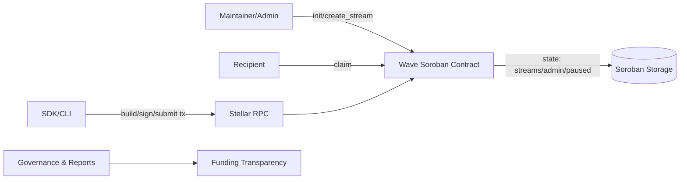

# Architecture

## System Overview

## Data Model

- `Admin`: contract owner for operational controls.
- `Paused`: emergency circuit-breaker for mutating operations.
- `Stream(id)`: recipient, amount, claimed amount, schedule.

## Security Model

1. **Authorization boundaries**
   - `init`, `create_stream`, `set_paused` require admin auth.
   - `claim` requires recipient auth.
2. **Failure safety**
   - explicit error codes for bad schedule, unauthorized access, and paused state.
3. **Deterministic vesting**
   - claimable amount computed from ledger sequence and stream schedule.

## SEP/CAP Notes

- Design is compatible with Stellar testnet and can integrate with SEP-driven off-chain flows.
- If integrating anchors/payments, document relevant SEP-6/24/41 endpoints and auth policies.

